# Credit_Risk_Analysis

## Overview

In this repository, we use machine learning to predict credit risk using metrics obtained from various loan applicants in our loan stats csv.  Many factors contribute to credit risk, and this is a historically difficult target to predict, so it is a perfect use case for machine learning.  We use supervised machine learning with various sampling approaches and compare the efficacy of each method.

## Results

- The naive random oversampling has an accuracy score of 64.3%, a precision of nearly 100%, and a recall of 69%.

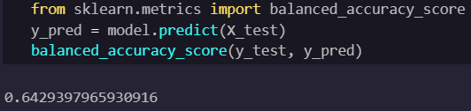
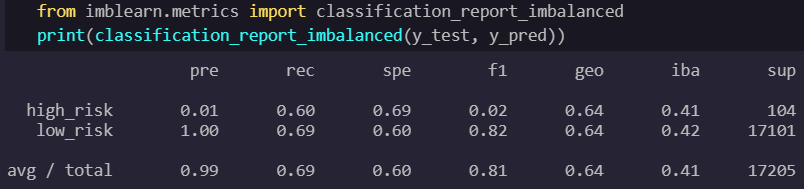

- The smote oversampling algorithm has an accuracy score of 64.7% with a precision of nearly 100% and a recall of 73%.

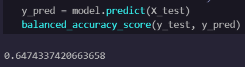
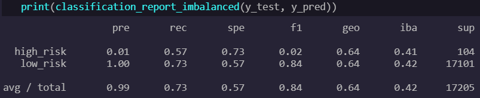

- The cluster centroid method, an undersampling method, has an accuracy score of 64.7% with precisions and recall of nearly 100% and 52% respectively.

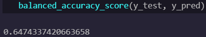
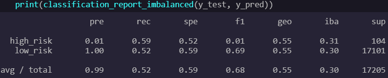

- The SMOTENN method, which is a mix of undersampling and oversampling has an accuracy score of 55.4% with precisions and recall of nearly 100% and 56% respectively.

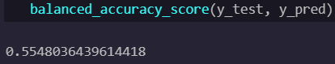
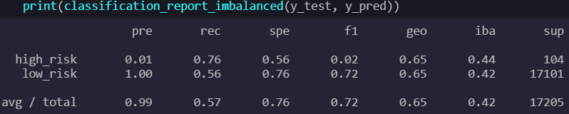

- The balanced random forest classifier has an accuracy score of 77.4% with a precision and recall of 97% and 87% respectively.

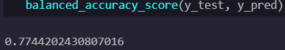

- The adaboost method, an aggregate of weak learners, boasts an accuracy score of 93.3% with a precision and recall of 91% and 94% respectively.

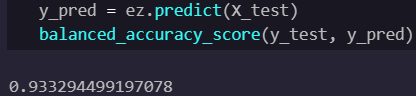
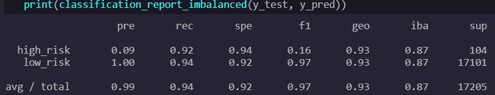

## Summary

Most of the learning algorithms--with adaboost as an outlier--performed relatively equally with accuracy scores hovering around 64% with the worst performing being SMOTENN with an accuracy of 55.4% and the best being adaboost with an accuracy of 93.3%.  Although the precision of adaboost is about 9% lower than the precisions of the other algorithms, I would still choose the adaboost method for several reasons.  Denying a loan application for someone who likely should have received the loan is less destructive than approving a loan for someone who should not have been approved.  These are what precision and recall are measuring.  The higher the precision, the less false positives the model will produce, and the higher the recall, the less false negatives the model will produce.  When it comes to loan applications, we want to minimize false negatives, because if a false negative makes it through, then a detrimental loan will be made.  The adaboost model far outperforms the other models in terms of recall, so it is likely the best algorithm for this use case.